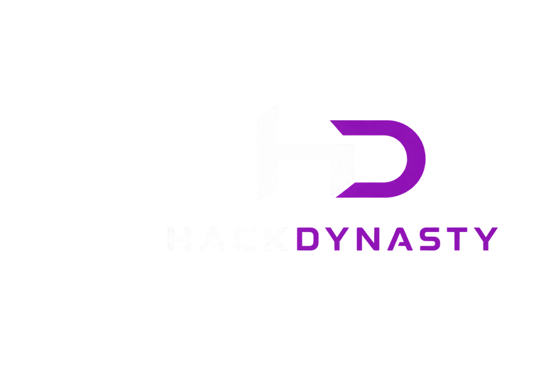

# HackDynasty 🚀

> Elite team of innovators, developers, and researchers building the future through technology and competitive hackathons.

## 🌐 Live Platform
Experience the official HackDynasty platform with custom rocket flight cursor physics, real-time particle starfield, and interactive member profiles:
- **Instagram**: [@teamhackdynasty](https://www.instagram.com/teamhackdynasty?igsi=YjF0Yjd3MG8wYXJ3)
- **Linktree**: [hackdynasty](https://linktr.ee/hackdynasty?utm_source=linktree_profile_share&ltsid=3f3a556b-6df7-497f-bd1e-c6eaf205ad3b)
- **Email**: [teamhackdynasty@gmail.com](mailto:teamhackdynasty@gmail.com)

---

## 👥 Founding Members

| Member | Focus Areas & Roles | Profiles |
| :--- | :--- | :--- |
| **Aarav Jain** | Frontend Architecture, Testing & Research | [GitHub](https://github.com/aaravjain200806-hue) · [LinkedIn](https://www.linkedin.com/in/aarav-jain-007684372) |
| **Naitik Jain** | Backend Engineering, Integration & Research | [GitHub](https://github.com/Naitikjain101) · [LinkedIn](https://www.linkedin.com/in/naitikjain08) |
| **Kanishak Jain** | Backend (Database), API Design & Research | [GitHub](https://github.com/kanishakjain) · [LinkedIn](https://www.linkedin.com/in/kanishakjain) |
| **Arhan Jain** | Presentation Strategy, Problem Discovery & Research | [GitHub](https://github.com/Arhanjain95) · [LinkedIn](https://www.linkedin.com/in/arhan-jain-203145384) |

---

## ⚡ Key Features
- **Official Brand Theme**: Sleek Dark Mode with Pure White (`#FFFFFF`) and Electric Logo Purple (`#8F12B5` / `#B83BE0`).
- **Rocket Cursor Physics**: Trajectory angle calculation, thruster flame flicker, and glowing exhaust spark trails.
- **Interactive Profiles**: Glassmorphic modal displaying roles, responsibilities, and direct social links.
- **Innovation Pipeline**: Modular project showcase cards with tech stack tags and sprint status badges.
- **Minimal Contact Hub**: Direct email button with official Instagram and Linktree channel pills.

---

## 🛠️ Tech Stack
- HTML5 / Vanilla CSS3 / Modern JavaScript (ES6+)
- Tailwind CSS & Lucide Icons
- FontAwesome 6 & Google Fonts (Space Grotesk, Inter)
- HTML5 Canvas Particle Engine

---

© 2024 **HackDynasty**. Crafted with passion, powered by innovation.
